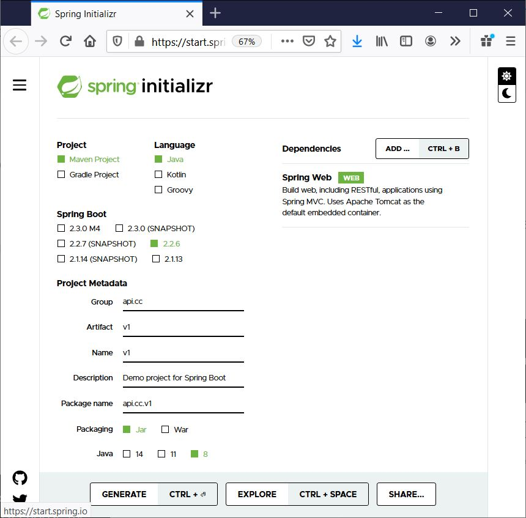
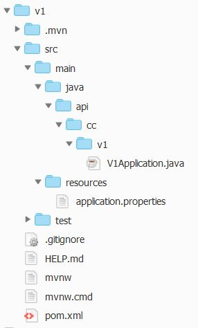
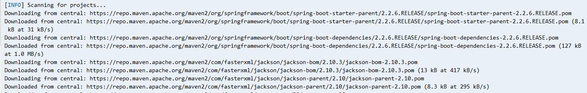
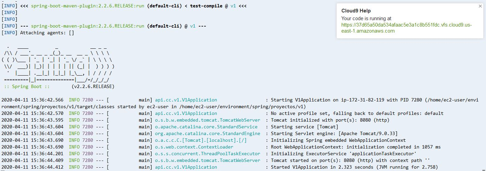
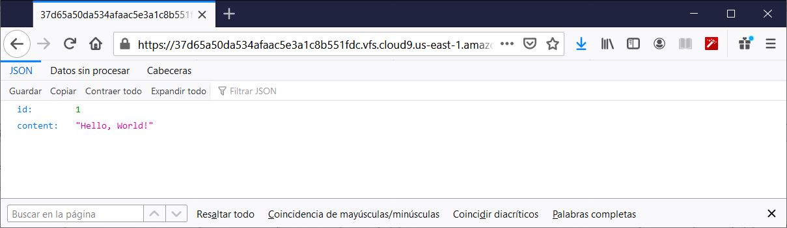

# Spring: Ejemplo básico de REST Web Service

## Requisitos

- Entorno de Desarrollo (IDE - Integrated Developer Environment (IDE), como Spring Tools, Visual Studio Code, Eclipse o cualquier otro.
En esta guía se utilizará AWS Cloud9.

- Kit de desarollo de Java (JDK - Java Development Kit), como Open JDK o Java SE JDK.

## Spring Boot

Spring Boot nos facilita el uso del Framework Spring simplificando el proceso de programación y, sobre todo, de configuración del proyecto.

Podemos crear la estructura un proyecto Spring desde https://start.spring.io/ donde debemos elegir el tipo de proyecto (Maven o Gradle),
el lengauje de programacion (Java, Kotlin o Groovy), establecer los metadatos (nombre, descripción, versión de Java, etc) y las
dependencias (librerías que incorporaremos a nuestro proyecto, dependiendo de la funcionalidad a implementar).


Comencemos creando un proyecto cumplimentando el Spring Initializr con la información
que muestra la figura:



Una vez cumplimentada, pulsa sobre el icono "Generate" para guardar el fichero con la estructura del proyecto, 
descomprime el contenido y cópialo en una carpeta en el entorno AWS Cloud9.




En este momento, es interesante que analices el contenido del fichero pom.xml y src/main/java/api/cc/v1/V1Application.java.

## Crear una clase POJO Java

En la carpeta src/main/java/api/cc/v1/ crear una clase Java (en un fichero Greeting.java) con el siguiente contenido:

```java
package api.cc.v1;

public class Greeting {

	private final long id;
	private final String content;

	public Greeting(long id, String content) {
		this.id = id;
		this.content = content;
	}

	public long getId() {
		return id;
	}

	public String getContent() {
		return content;
	}
}
```

## Crear un Controlador

En la carpeta src/main/java/api/cc/v1/ crea un controlador, una clase Java (en un fichero GreetingController.java),
para que reciba las peticiones REST, con el siguiente contenido:


```java
package api.cc.v1;

import java.util.concurrent.atomic.AtomicLong;

import org.springframework.web.bind.annotation.GetMapping;
import org.springframework.web.bind.annotation.RequestParam;
import org.springframework.web.bind.annotation.RestController;

@RestController
public class GreetingController {

	private static final String template = "Hello, %s!";
	private final AtomicLong counter = new AtomicLong();

	@GetMapping("/")
	public Greeting greeting(@RequestParam(value = "name", defaultValue = "World") String name) {
		return new Greeting(counter.incrementAndGet(), String.format(template, name));
	}
}
```


## Ejecuta el proyecto

Cambia los permisos al fichero 'mvnw' para que sea ejecutable con:
```
$ chmod 744 mvnw
```
Lanza el proyecto con:

```
$ ./mvnw spring-boot:run
```

Comenzarán a descargarse todas las dependencias (la primera vez puede tardar algún tiempo):



y cuando finalice se lanzará el proyecto.



Como podrás ver, AWS Cloud9 te muestra en la parte izquierda un mensaje con la URL del proyecto.

Abre el navegador con esa URL para comprobar que funciona adecuadamente.

