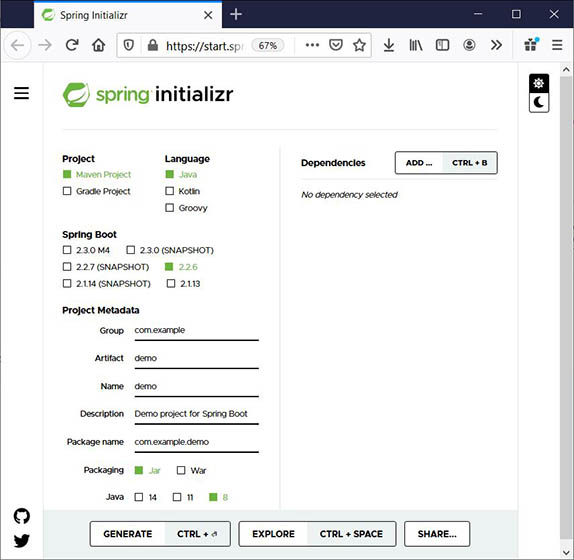

# Spring

## Requisitos

- Entorno de Desarrollo (IDE - Integrated Developer Environment (IDE), como Spring Tools, Visual Studio Code, Eclipse o cualquier otro.
En esta guía se utilizará AWS Cloud9.

- Kit de desarollo de Java (JDK - Java Development Kit), como Open JDK o Java SE JDK.

## Spring Boot

Spring Boot nos facilita el uso del Framework Spring simplificando el proceso de configuración del proyecto.

Podemos crear la estructura un proyecto Spring desde https://start.spring.io/ donde debemos elegir el tipo de proyecto (Maven o Gradle),
el lengauje de programacion (java, Kotlin o Groovy), establecer los metadatos (nombre, descripción, versión de Java, etc) y las
dependencias (librerías que incorporaremos a nuestro proyecto, dependiendo de la funcionalidad a implementar)

